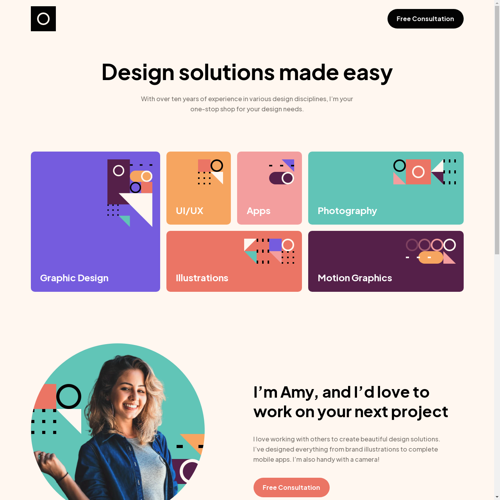

# Frontend Mentor - Single-page-design-portfolio

This is a solution to the [Scoot website challenge on Frontend Mentor](https://www.frontendmentor.io/challenges/singlepage-design-portfolio-2MMhyhfKVo). Frontend Mentor challenges help you improve your coding skills by building realistic projects. 

## Table of contents

- [Overview](#overview)
  - [The challenge](#the-challenge)
  - [Screenshot](#screenshot)
  - [Links](#links)
- [My process](#my-process)
  - [Built with](#built-with)
  - [What I learned](#what-i-learned)
  - [Continued development](#continued-development)
  - [Useful resources](#useful-resources)
- [Author](#author)
- [Acknowledgments](#acknowledgments)

## Overview

### The challenge

Users should be able to:

- View the optimal layout for each page depending on their device's screen size
- See hover states for all interactive elements throughout the site

### Screenshot




### Links

[Live Solution](https://www.frontendmentor.io/challenges/singlepage-design-portfolio-2MMhyhfKVo)

## My process

This is the second premium challenge I have attempted on Frontend Mentor. I chose this challenge because I wanted to get a little more practice with CSS grid.
I began looking at the figma files and trying to structure my HTML based on the desktop version. 
I took the mobile first approach.

### Built with

- Semantic HTML5 markup
- SASS/CSS
- Flexbox
- CSS grid
- Vanilla JavaScript
- Mobile-first workflow


### What I learned / What I noted down

1. After a couple of attempts to create slider from scratch, I decided to use 'swiperjs' to implement the touch sliding gallery. I changed a lot of the CSS values to match the design files and edited a small amount of JS.

Here is some the JS that is used for the slider.

1. I changed the slidesPerView value to 'auto' , increased the width and set centeredSlides to true.
```javascript
var swiper = new Swiper(".swiper", {
    slidesPerView: 'auto',
    spaceBetween: 15,
    slidesPerGroup: 1,
    centeredSlides: true,
    loop: true,
    loopFillGroupWithBlank: true,
    pagination: {
      el: ".swiper-pagination",
      clickable: true,
    },
    navigation: {
      nextEl: ".swiper-button-next",
      prevEl: ".swiper-button-prev",
    },

    
  });

```

### Things I would do differently 

1. I did set the typography sizes for different headings but found myself adding a lot of media queries to change
the sizes on bigger screens. Perphaps it would have been better to add a second class to the element
that can be reused.

### Things I am still not sure about

1. I was not sure how to make the slider extend slightly beyond the max with of the container without
breaking the layout (using absolute positioning) or taking the slider out of the container. I suppose that
I could have let the swiper fill the max width and added padding to the rest of the content, but that seemed a little inconvenient.

## Acknowledgments / Useful resources

- [Swiper](https://swiperjs.com/) - 'Swiper is the most modern free mobile touch slider with hardware accelerated transitions and amazing native behavior. It is intended to be used in mobile websites, mobile web apps, and mobile native/hybrid apps.'


